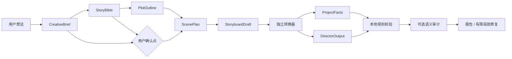
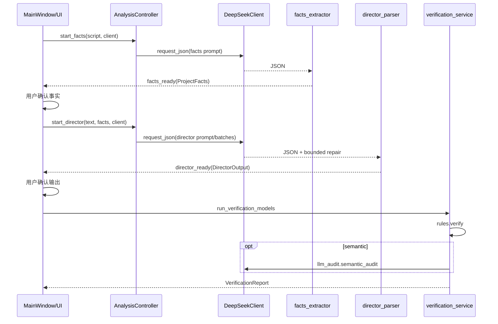

# AI Creator v0.3.0：架构设计（Phase 0）

## 1. 结论与不变量

v0.3.0 新增的是独立的“AI 分镜创作”能力，不改变既有核验产品的职责：**生成器可以创造，核验器只检查**。生成域不得调用或改写 `rules.py`、`llm_audit.py`、`verification_service.py`、既有 `facts_extractor.py` 或 `director_parser.py` 来承担创作。最终仅通过新转换器把用户已确认的创作结果投射为既有 `ProjectFacts` 和 `DirectorOutput`，再调用稳定核验入口。

所有字段都附带来源：`user_explicit`（用户明确输入）、`ai_inference`（模型建议）、`user_confirmed`（用户确认）、`generated`（生成产物）、`verification_result`（核验结果）、`auto_repair`（局部修复产物）。`ai_inference` 绝不能静默升级为用户事实；其进入权威约束集合前必须经用户确认。



## 2. 已审计的现状运行链路

桌面程序：`desktop_app.py` → `creator_desktop.app.run()` → `MainWindow`。主窗体提供“普通创作者模式”和“专业 JSON 模式”。后者由 `VerificationController` 在线程中调用 `verification_service.run_verification()`；前者由 `AnalysisController` 依次调用现有事实提取器、人工事实确认、现有导演文本解析器、人工导演输出确认、`run_verification_models()`。两类控制器都使用 daemon thread + `queue.Queue`，主线程每 100ms 轮询事件。



API Key 在桌面端由 `keyring` 通过 Windows Credential Manager 保存；CLI 从环境变量（可由 `.env` 加载）读出。桌面语义审计会临时置入 `DEEPSEEK_API_KEY`，以锁保护并恢复环境；日志仅记录异常类型/元数据，不应记录密钥或请求正文。报告可从 UI 或 CLI 写为 JSON。PyInstaller 的入口为 `desktop_app.py`，捆绑 assets、examples、LICENSE；`build_windows.ps1` 运行 pytest、CLI 回归、冻结 smoke、便携包、Inno 安装器及敏感信息扫描。

## 3. 当前 DeepSeek 实现审计（2026-08-01）

| 项目 | 当前实现 | 官方现状 / 差距与建议 | 风险 |
|---|---|---|---|
| Base URL / SDK | `OpenAI(..., base_url=https://api.deepseek.com)`，`openai==2.45.0` | OpenAI 兼容格式仍为该 base URL 和 Chat Completions；SDK 应在 Phase 2 做兼容性契约测试 | 中 |
| 模型 | 默认 `deepseek-chat`（环境变量可覆盖） | 官方更新页称 legacy `deepseek-chat` / `deepseek-reasoner` 已计划于 2026-07-24 停用；当前文档列出 `deepseek-v4-flash`、`deepseek-v4-pro`。必须让 v0.3.0 的模型选择显式、可配置、可测试，不能继续隐式依赖旧默认 | 高 |
| 请求 | 两处均 `chat.completions.create`；结构化调用 `response_format={type: json_object}`，`stream=False` | JSON Output 支持此格式，但 prompt 必须含 `json` 且需要合理 `max_tokens`；现有生成提示包含 JSON，仍应由每阶段 prompt 契约保证 | 中 |
| 参数 | importer：45s、temperature=0、max_tokens=8000；语义审计：max_tokens=5000、temperature=0，无显式 timeout | thinking 模式下 temperature 不生效；新客户端必须按 model/mode 排除不支持参数，并统一 timeout | 高 |
| thinking / stream | 当前均未支持 thinking、流式、取消、usage/request id | 官方返回 `reasoning_content`、`finish_reason` 和 usage；流式有增量 delta。Phase 2 客户端须支持而 UI 阶段可按需启用 | 中 |
| 重试 | importer 仅 timeout/connection/5xx，最多 2；语义审计无显式重试 | 401、402、422 不重试；429/500/503 以有限退避重试；网络/超时可有限重试。绝不无限重试 | 高 |
| JSON / 截断 | JSON 清洗、解析和最多两次修复存在；`llm_audit` 检查空内容 | 还需检查 `finish_reason=length`、空 content、schema 失败；修复输入不可携带不必要敏感上下文 | 高 |
| 错误 | 已粗略映射 401、402/403、429、5xx、timeout、connection | 官方明确 401/402/422/429/500/503；Phase 2 应分出 `InsufficientBalanceError`、`InvalidRequestError` 等 | 中 |

官方依据：DeepSeek [Chat Completions](https://api-docs.deepseek.com/api/create-chat-completion)、[JSON Output](https://api-docs.deepseek.com/guides/json_mode/)、[错误码](https://api-docs.deepseek.com/quick_start/error_codes/)、[Thinking mode](https://api-docs.deepseek.com/guides/thinking_mode/) 与 [更新日志](https://api-docs.deepseek.com/updates)。

## 4. 建议目录与客户端边界

```text
story_generation/
  models/                 # 独立 Pydantic 创作模型
  prompts/
    idea_to_brief/v1/
    brief_to_story_bible/v1/
    story_bible_to_outline/v1/
    outline_to_scene_plan/v1/
    scene_plan_to_storyboard/v1/
    storyboard_repair/v1/
    storyboard_polish/v1/
  client/                 # 协议、DeepSeek 实现、fake client、错误和 usage
  pipeline/               # 阶段编排、保存点、确认和取消
  validators/             # 仅创作模型的本地一致性校验
  converters/             # 已确认 storyboard -> ProjectFacts/DirectorOutput
  storage/                # .ai_creator_project.json
  controller/             # UI 无关的后台控制器
  ui/                     # Phase 9 视图
```

`StoryClient` 仅暴露 `request_json()`、`request_text()`、`stream_text()`、`cancel()` 和 usage 记录；每次请求均传递 `model`、thinking mode、temperature、max_tokens、timeout、response_format、stream、request_id、stage_name。统一错误至少为：`AuthenticationError`、`InsufficientBalanceError`、`InvalidRequestError`、`RateLimitError`、`NetworkError`、`TimeoutError`、`ServerError`、`EmptyResponseError`、`TruncatedResponseError`、`InvalidJsonError`、`SchemaValidationError`、`CancelledError`。可重试：网络、超时、429、500、503、空响应（最多 2 次，指数退避+抖动）；不可重试：取消、401、402、422、schema/JSON（改走一次明确的局部 repair 阶段）。

## 5. 创作领域模型（仅设计）

| 模型 | 职责、必填字段（类型） | 来源 / 可编辑 / 权威约束 / 发给 DeepSeek / 导出 | 到旧模型转换 |
|---|---|---|---|
| `CreativeBrief` | 创作意图；`premise:str`、`format:str`、`target_duration_s:float`、`audience:str`、`tone:list[str]`、`constraints:list[Constraint]` | 用户+AI建议 / 是 / 用户确认后约束 / 是 / 是 | 约束和时长进入 `ProjectFacts` |
| `StoryBible` | 故事全局真相；`logline:str`、`theme:list[str]`、`characters:list[CharacterBible]`、`world:WorldBible`、`canon_rules:list[str]` | AI建议+确认 / 是 / 是 / 是 / 是 | 人物、地点、道具、硬约束进入 `ProjectFacts` |
| `CharacterBible` | 人物身份与弧线；`id:str`、`name:str`、`role:str`、`appearance:str`、`goals:list[str]`、`allowed_actions:list[str]` | AI/用户 / 是 / 确认后是 / 是 / 是 | `ProjectFacts.characters`，并约束 `DirectorOutput` |
| `WorldBible` | 场景世界观；`locations:list[Location]`、`props:list[Prop]`、`rules:list[str]` | AI/用户 / 是 / 确认后是 / 是 / 是 | `ProjectFacts.locations/props` |
| `PlotOutline` | 叙事大纲；`beats:list[PlotBeat]`、`ending:str` | AI / 是 / 否（确认后为计划约束） / 是 / 是 | 生成 shot 的 required events |
| `PlotBeat` | 单一叙事拍；`id:str`、`purpose:str`、`conflict:str`、`turn:str`、`source_refs:list[str]` | AI / 是 / 否 / 是 / 是 | 映射 scene required events |
| `ScenePlan` | 可执行场景规划；`scenes:list[Scene]`、`total_duration_s:float` | AI+确认 / 是 / 是 / 是 / 是 | `ProjectFacts.shots` 时间、地点、事件 |
| `StoryboardDraft` | 可编辑的分镜草案；`shots:list[StoryboardShot]`、`version:int` | AI+用户编辑 / 是 / 是 / 是 / 是 | 转为两个稳定模型 |
| `StoryboardShot` | 镜头；`id:str`、`scene_id:str`、`duration_s:float`、`characters:list[str]`、`first_frame:str`、`action:str`、`dialogue:list[Line]`、`camera:str`、`continuity_refs:list[str]` | AI+用户 / 是 / 确认后是 / 是 / 是 | 一个 `ProjectFacts.shot` + 一个 `DirectorOutput.shot` |
| `GenerationRequest` | 一次阶段请求；`stage_name:str`、`input_refs:list[str]`、`prompt_version:str`、`request_id:str` | 系统 / 否 / 否 / 是 / 元数据 | 不转换 |
| `GenerationSettings` | 模型行为；`model:str`、`thinking_mode:enum`、`temperature:float|None`、`max_tokens:int`、`timeout_s:float` | 用户设置 / 是 / 否 / 是 / 是（无 key） | 不转换 |
| `GenerationMetadata` | 可追溯而不泄密；`request_id`、`model`、`prompt_version`、`usage`、`finish_reason`、timestamps | 系统 / 否 / 否 / 否 / 是（脱敏） | 不转换 |
| `GenerationIssue` | 创作期错误/警告；`code`、`severity`、`path`、`message`、`retryable` | 系统 / 否 / 否 / 否 / 是 | 不转换 |
| `GenerationResult` | 阶段结果；`status`、`artifact_ref`、`issues`、`metadata`、`repair_of` | 系统 / 否 / 否 / 否 / 是 | 仅确认后的 artifact 转换 |

转换器必须无网络、确定性、可单测；拒绝未确认的 AI 推断、重复 shot ID、未定义人物/道具、时间重叠和总时长不符。它不得“修补”事实，只返回可定位的转换问题。

## 6. 分阶段生成管线

| 阶段 | 输入 → 输出；模型 / thinking；参数与格式 | 失败、重试、取消、保存/确认、测试 |
|---|---|---|
| Idea→Brief | 用户想法 → `CreativeBrief`；快速模型、关闭 thinking；0.4 / 2k / JSON | 空/JSON/schema可重试一次；取消即停；保存草稿；**确认 Brief**；空/超长中文/schema 测试 |
| Brief→Bible | 已确认 Brief → `StoryBible`；质量模型、可选 high thinking；thinking 时温度为 None / 5k / JSON | 401/402/422 不重试；429/5xx/网络最多2；保存 Bible；**确认角色/世界观**；人物漂移测试 |
| Bible→Outline | Bible → `PlotOutline`；质量模型、high thinking；None / 4k / JSON | 处理截断为 `TruncatedResponseError`；保存；确认大纲；beat 关联测试 |
| Outline→Scene | 已确认 Outline/Bible → `ScenePlan`；质量模型、按复杂度 thinking；0.2（非 thinking）/ 6k / JSON | 本地时长/地点校验；仅局部重试失败场景；保存；确认场景；总时长/重叠测试 |
| Scene→Storyboard | ScenePlan → `StoryboardDraft`；质量模型、非 thinking 或 high；0.2/8k/JSON，可按 scene 分批 | 失败镜头可局部重试，不能重写已确认镜头；保存每批；**确认分镜**；重复 ID/未定义人物测试 |
| Validate/convert | 已确认 storyboard → 稳定模型 → 本地核验 → 可选语义审计；无创作模型 | 不自动重试核验；取消语义请求；保存报告；用户选择局部修复；旧核验回归 |
| Repair/polish | 用户选定 issue 和最小上下文 → 局部 `StoryboardShot` patch；质量模型，默认非 thinking；0.1/2k/JSON | 只允许目标字段、一次 repair；再次转换/核验；保留前版本；修复失败/上限测试 |

禁止以一次 API 请求直接生成完整小说和全部分镜。每阶段输入、输出、保存点和确认点均可恢复；重复点击应由 controller 以 request_id/运行状态拒绝或合并。

## 7. 提示词系统

每个 `story_generation/prompts/<stage>/vN/` 包含：`system.md`、`task.md`、`constraints.md`、`output_schema.json`、`quality_checklist.md`、`repair_context.md`（只对 repair）及 manifest（版本、适用模型、hash）。运行时组合顺序固定为 system → 任务 → 已确认专业约束 → 用户材料 → schema → 禁止行为 → 质量清单 → 必要 repair 上下文。提示词不得散落在 UI、控制器或 API 客户端。

目录至少含：`idea_to_brief`、`brief_to_story_bible`、`story_bible_to_outline`、`outline_to_scene_plan`、`scene_plan_to_storyboard`、`storyboard_repair`、`storyboard_polish`。所有结构化提示必须显式要求 `json`，并声明不得把推测写为用户事实。

## 8. UI、保存与导出设计

未来模式固定为：AI 分镜创作、文本方案核验、专业 JSON 核验。AI 分镜创作页包含创意输入、极简模式、高级设置、Brief 确认、人物/世界观确认、阶段进度、取消、结果预览、局部重做、分镜编辑、运行核验和导出。生成中 UI 只消费结构化事件，不直接拼 prompt。

项目格式为 `.ai_creator_project.json`，顶层必须有：`schema_version`、`prompt_versions`、`generation_settings`、`creative_brief`、`story_bible`、`plot_outline`、`scene_plan`、`storyboard`、`verification_result`、`generation_metadata`。禁止写入 API Key、系统凭据、无必要隐私数据或完整敏感日志。导出支持 Markdown、TXT、结构化 JSON 和现有核验 JSON；第一阶段不新增 DOCX 依赖。

## 9. 测试架构

后续新增：`test_story_models.py`、`test_story_prompt_versions.py`、`test_story_client.py`、`test_story_pipeline.py`、`test_story_validators.py`、`test_story_converters.py`、`test_story_project_storage.py`、`test_story_generation_controller.py`、`test_story_generator_view.py`。全部使用 fake client 或 mock transport，CI 禁止真实付费 API。

覆盖：空输入、超长中文、正常/空/截断/无效 JSON、schema 错误、401/402/422/429/500/503、断网、超时、取消、重复点击、重复镜头 ID、人物未定义/漂移、道具凭空出现、时间重叠、总时长错误、repair 失败/上限、API Key 泄露、保存恢复、旧核验功能回归。

## 10. 实施路线与完成定义

| Phase | 修改/新增范围 | 测试与完成定义 | 回滚与主要风险 |
|---|---|---|---|
| 0 架构审计 | 本两份文档 | 文件/链路/API 差距可审阅 | 回滚本 commit；设计误读 |
| 1 模型/本地验证 | `story_generation/models,validators` | 新模型和不变量单测 | 删除独立目录；污染旧模型 |
| 2 客户端/fake | `client` | 全错误、取消、usage、mock 测试 | 关闭新入口；付费/无限重试 |
| 3 CreativeBrief | prompt/pipeline brief | 明确输入和确认测试 | 不启用 UI；推断越权 |
| 4 Bible/Outline | 相应模型/prompt/pipeline | 角色、世界观、beat 测试 | 回退项目 schema；事实漂移 |
| 5 Scene/Storyboard | 相应模型/prompt/pipeline | 时长、镜头 ID、连续性测试 | 保留旧项目；大响应截断 |
| 6 转稳定模型 | converters | 确定性转换和旧 fixtures | 禁用导出；语义变形 |
| 7 接核验器 | adapter/controller | 旧 service 回归 | 仅导出草案；耦合内核 |
| 8 局部修复 | repair pipeline | 最小 patch、次数上限 | 保留前版本；全局重写 |
| 9 桌面 UI | `ui`、窗口集成 | controller/view 测试、手工验收 | feature flag/隐藏入口；线程问题 |
| 10 保存/导出/打包 | storage/export/packaging（经批准后） | 恢复、打包、验收 | schema migration；凭据泄露 |

Phase 0 之后停止，等待架构审查；不得开始 Phase 1。
